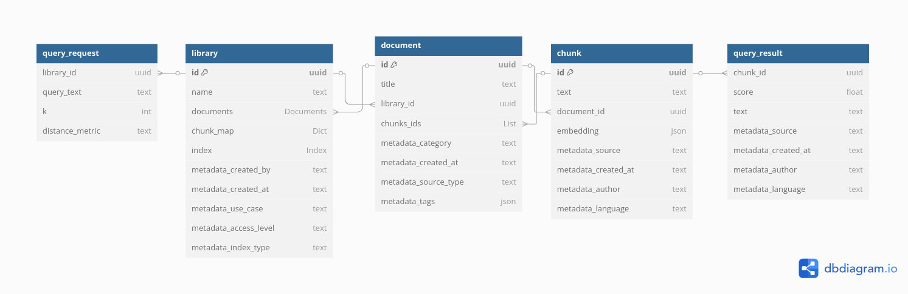

##  Project Overview

This project provides a **REST API** for managing a custom in-memory **vector database** with semantic search capabilities.

Users can:
- **Create, read, update, and delete** libraries
- **Add and manage documents** within each library
- **Add, update, and remove chunks** from documents

Chunks (text + metadata) are automatically vectorized and stored. Each library maintains its own index (e.g., **Linear** or **KD-Tree**) over its chunks, enabling **k-nearest neighbor (k-NN)** search for semantically similar content.


## Technical Architecture & Choices

### Data Model



#### 1. **Chunk**
- **Definition**: A `Chunk` is the atomic unit of text + vector embedding + metadata.
- **Model**:
  ```python
  class Chunk(BaseModel):
      id: str
      text: str
      embedding: List[float]
      metadata: Optional[ChunkMetadata]
  ```

#### 2. **Document**
- **Definition**: A `Document` is a logical grouping of chunks.
- **Model**:
  ```python
  class Document(BaseModel):
      id: str
      title: str
      chunk_ids: List[str]
      metadata: Optional[DocumentMetadata]
  ```
-  By storing only `chunk_ids`, the document remains lightweight and allows modular access to underlying chunks stored in the library.

#### 3. **Library**
- **Definition**: A `Library` is a top-level collection of documents + centralized chunk storage + index.
- **Model**:
  ```python
  class Library(BaseModel):
      id: str
      name: str
      documents: Dict[str, Document]
      chunk_map: Dict[str, Chunk]
      index: LinearIndex
      metadata: Optional[LibraryMetadata]
  ```

- Provides fast lookup (`chunk_map`)
- Maintains consistency through encapsulated `add/update/remove` operations
- Supports indexing via `LinearIndex` and enables k-NN search


###  Fixed Schemas

I followed the task's suggestion and used fixed schemas for metadata to keep things simple and robust.

Here are the fixed metadata schemas:

```python
class ChunkMetadata(BaseModel):
    source: str
    created_at: str
    author: str
    language: str

class DocumentMetadata(BaseModel):
    category: str
    created_at: str
    source_type: str
    tags: List[str]

class LibraryMetadata(BaseModel):
    created_by: str
    created_at: str
    use_case: str
    access_level: Literal["private", "public", "restricted"] = "private"
```


### Vector Indexing

#### 1. **Linear Index (Brute-Force Search)**

- **Time Complexity**:
  - Insert: **O(1)** per chunk
  - Search: **O(n)** per query (where *n* = number of chunks)
- **Space Complexity**: **O(n·d)** (where *d* = embedding dimension)
- **Use Case**: Default fallback, simplest and most reliable for small-to-medium datasets.
- **Tradeoffs**:
  - Simple, deterministic, no preprocessing
  - Doesn’t scale well for large datasets (slow search)

```python
class LinearIndex:
    def search(self, query: List[float], k: int) -> List[Tuple[str, float]]:
        distances = []
        for cid, vec in self.vectors.items():
            dist = self.distance_fn(query, vec)
            distances.append((cid, dist))
        distances.sort(key=lambda x: x[1])
        return distances[:k]
```

---

#### 2. **KD-Tree Index**

- **Time Complexity**:
  - Insert: **O(log n)** (average), **O(n)** (worst case if unbalanced)
  - Search: **O(log n)** (best), **O(n)** (worst)
- **Space Complexity**: **O(n)** for the tree structure
- **Use Case**: Spatial partitioning for faster k-NN in lower dimensions.
- **Tradeoffs**:
  - Better than linear search for balanced, low-dimensional data (ideal < 20D)
  - Degrades in high dimensions (curse of dimensionality), no balancing logic
  - Rebuilding needed after bulk updates

```python
class KDTreeIndex:
    def search(self, query: List[float], k: int) -> List[Tuple[str, float]]:
        best = []  # list of (distance, chunk_id)

        def _search(node: Optional[KDNode], depth: int):
            if node is None:
                return

            dist = self.distance_fn(query, node.point)
            if len(best) < k:
                best.append((dist, node.chunk_id))
                best.sort()
            elif dist < best[-1][0]:
                best[-1] = (dist, node.chunk_id)
                best.sort()

            axis = depth % self.k
            next_branch = None
            opposite_branch = None

            if query[axis] < node.point[axis]:
                next_branch = node.left
                opposite_branch = node.right
            else:
                next_branch = node.right
                opposite_branch = node.left

            _search(next_branch, depth + 1)

            if len(best) < k or abs(query[axis] - node.point[axis]) < best[-1][0]:
                _search(opposite_branch, depth + 1)

        _search(self.root, 0)
        return [(cid, dist) for dist, cid in best]
```

---

### Tradeoffs

- **Linear Index**: Easy to implement, test, and debug. Guaranteed to work in all scenarios, regardless of data distribution or dimensionality.
- **KD-Tree Index**: More efficient for low-dimension embeddings with static or moderately changing data. Offers insight into spatial indexing tradeoffs.


In this project, both indexes are fully rebuilt after chunk deletions or updates for consistency and simplicity. While KD-Tree needs rebuilding to stay balanced, the Linear Index technically does not (its structure supports in-place updates efficiently). The unified rebuild strategy was chosen to reduce complexity and keep the indexing logic consistent across implementations.

### Concurrency & Data Consistency

- `RLock` ensures thread-safe access to in-memory data and indexing operations.

- All CRUD actions are wrapped to avoid data races and ensure consistent state.

- Index updates and persistence are atomic to prevent partial writes.

- Each library manages its own index, avoiding shared mutable state.

### Persistence Layer

- The system persists data to a local JSON file (data/db.json) using model_dump() from Pydantic.

- Data is saved after every CRUD operation to ensure consistency across restarts.

- On startup, the database is restored and indexes are rebuilt.


##  API Overview

###  CRUD Libraries
####  `/libraries`
- `POST /libraries/` – Create a new library. Optional query parameter `index_type` sets the indexing strategy (e.g., LINEAR).
- `GET /libraries/` – List all libraries.
- `GET /libraries/{library_id}` – Retrieve a specific library by ID.
- `PUT /libraries/{library_id}` – Update an existing library's name and metadata.
- `DELETE /libraries/{library_id}` – Delete a library by ID.

### CRUD Documents
#### `/libraries/{library_id}/documents` 
- `POST /libraries/{library_id}/documents/` – Create a new document within the specified library.
- `GET /libraries/{library_id}/documents/` – List all documents in a library.
- `GET /libraries/{library_id}/documents/{document_id}` – Retrieve a specific document by ID.
- `PUT /libraries/{library_id}/documents/{document_id}` – Update an existing document’s content and metadata.
- `DELETE /libraries/{library_id}/documents/{document_id}` – Delete a document and its associated chunks.

### CRUD Chunks
#### `/libraries/{library_id}/documents/{document_id}/chunks` 
- `POST /libraries/{library_id}/documents/{document_id}/chunks/` – Add a new chunk to the specified document.
- `GET /libraries/{library_id}/documents/{document_id}/chunks/` – List all chunks in a document.
- `GET /libraries/{library_id}/documents/{document_id}/chunks/{chunk_id}` – Retrieve a specific chunk by ID.
- `PUT /libraries/{library_id}/documents/{document_id}/chunks/{chunk_id}` – Update an existing chunk.
- `DELETE /libraries/{library_id}/documents/{document_id}/chunks/{chunk_id}` – Delete a chunk from a document.


### kNN Search
#### `/query` 
- `POST /query` – Perform a k-nearest neighbor search in a specified library.
  - Requires: `library_id`, `query_text`, `k` (number of neighbors), and optional `distance_metric` (e.g., cosine or euclidean).


### ADD POSTMAN COLLECTION

---


## 🧪 Testing

- **Test Files**:  
  - `tests/test_main.py` – covers CRUD operations for libraries, documents, and chunks.  
  - `tests/test_query.py` – tests vector indexing and query behavior (add, delete, search).  
- **Framework**: [pytest](https://docs.pytest.org/)  
- **Run tests**:  
  ```bash
  pytest
  ```

##  Optional Enhancements

- Data persistence


## 🚀 Getting Started

Instructions:
```bash
# Clone repo
git clone https://github.com/curroramos/stack-ai
cd stack-ai

# Install dependencies
pip install -r requirements.txt

# Run app
uvicorn app.main:app --reload

# Run tests
pytest
```

## 🐳 Docker & Kubernetes

This project is containerized and can be deployed using [Helm](https://helm.sh) on a local Kubernetes cluster powered by [Minikube](https://minikube.sigs.k8s.io/).

### 🛠 Prerequisites

Make sure the following tools are installed on your system:

- [Docker](https://www.docker.com/)
- [Minikube](https://minikube.sigs.k8s.io/)
- [Helm](https://helm.sh/)
- [kubectl](https://kubernetes.io/docs/tasks/tools/)

---

### 📦 1. Start Minikube

```bash
minikube start
```

(Optional) Launch the Kubernetes dashboard:

```bash
minikube dashboard
```

### 🐋 2. Build and Push Docker Image

Build and push the image to Docker Hub (already done):

```bash
docker build -t stack-ai-vector-db:latest .
docker tag stack-ai-vector-db:latest franciscoramos3010/stack-ai-vector-db:latest
docker push franciscoramos3010/stack-ai-vector-db:latest
```

> 🔁 Replace `franciscoramos3010` with your Docker Hub username if needed.

---

### 📦 3. Helm Chart Structure

Ensure the Helm chart directory is structured as follows:

```
charts/
└── stack-ai-vector-db/
    ├── Chart.yaml
    ├── values.yaml
    └── templates/
        ├── deployment.yaml
        └── service.yaml
```

---

### ⚙️ 4. Update `values.yaml`

In `charts/stack-ai-vector-db/values.yaml`, set:

```yaml
image:
  repository: franciscoramos3010/stack-ai-vector-db
  tag: latest
  pullPolicy: IfNotPresent

service:
  type: NodePort  # or ClusterIP if you're using Ingress instead
  port: 8000
```

---

### 📦 5. Deploy with Helm

From the root of your project, install the chart:

```bash
helm install stack-ai-vector-db charts/stack-ai-vector-db
```

To apply updates:

```bash
helm upgrade stack-ai-vector-db charts/stack-ai-vector-db
```

---

### 🌐 6. Access the API

To access the API:

#### Option A: Use `minikube service` (for local clusters)

```bash
minikube service stack-ai-vector-db
```

This opens your browser to:

```
http://<minikube-ip>:<node-port>/docs
```

#### Option B: Get NodePort manually

```bash
kubectl get svc stack-ai-vector-db
```

Then open:
```
http://<minikube-ip>:<node-port>/docs
```

---

### ✅ 7. Verify Deployment

Check if everything's running:

```bash
kubectl get pods
kubectl logs <your-pod-name>
```

---

## 📚 Future Improvements

You can list things like:
- Better indexing algorithms.
- Real database integration.
- Full-text chunking + embedding pipeline.
- Real user auth.


## TODO
add error handling